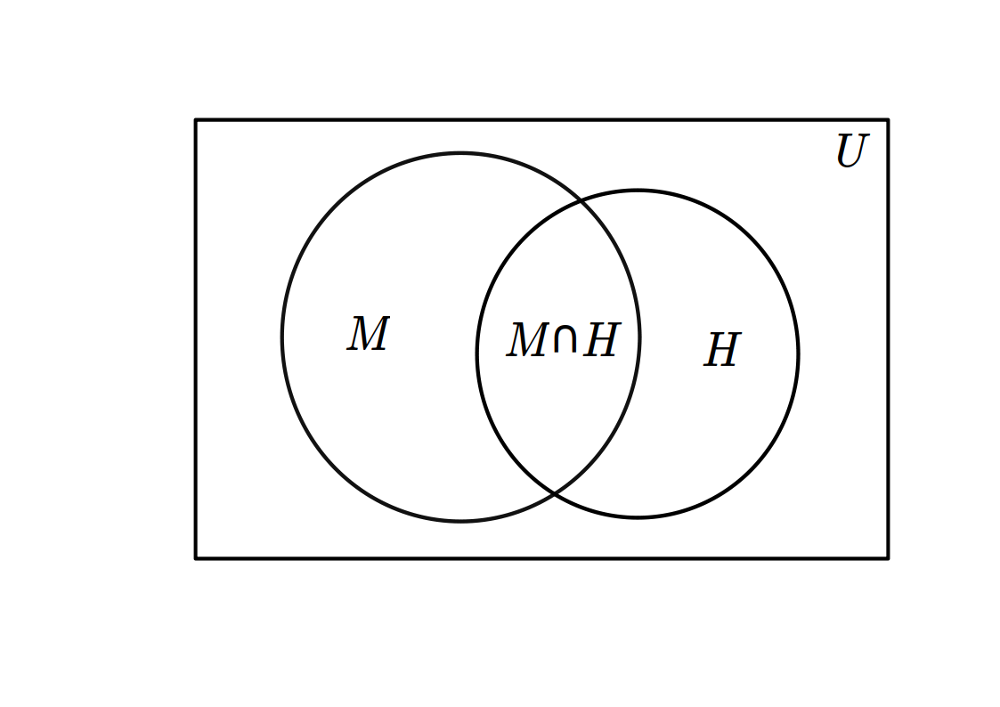
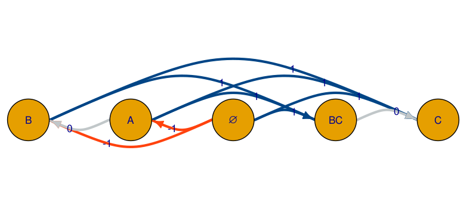

```{r setup, include=FALSE}
options(htmltools.dir.version = FALSE)
```

class: middle left inverse

```{r, include = FALSE}
options(knitr.kable.NA = "")
library(data.table)
library(Cairo)
library(ggplot2)
library(ggthemes)
library(ggrepel)
library(emo)
library(fontawesome)
library(ply207)
library(gt)

## import data

fnames <- list.files(path = 'data', include.dirs = T, full.names = T)
for (i in seq(fnames)) {
  load(fnames[i])
}
rm(fnames, i)

```

.left-column[

## XKCD:2323

[](https://xkcd.com/2323)

]
.right-column[

## Structure

1. The framework
1. The tools
1. The phenomenon
1. The method
1. The findings

]

---

class: top left inverse

## The framework: *local* model behaviour

<br><br>

* The traditional approach used in all areas of Psychology
* A measure of how well a model accommodates an already observed data pattern

> A measure of how well a model accommodates (reproduces) and already-observed data pattern. 

```python
if (model_value == human_aggregate):
    print("Good Model")
else:
    print("Bad Model")
```

---

class: top left inverse

## The framework: *global* model behaviour

Robert and Pashler (2000) pointed out three distinct areas not covered by a goodness-of-fit:

1. `prediction` What does the model say will happen?
2. `heterogeneity` Between-subject variability is not explained by goodness-of-fit.
3. `*a priori* likelihood` How likely that the model will be a good fit?

We evaluate models on these neglected areas of formal modelling.

---

class: top left inverse

## The tools: parameter space partitioning

.pull-left[

<p style="align:center">
<iframe title="vimeo-player" src="https://player.vimeo.com/video/652405415?h=ffafca4001" width="640" height="426" frameborder="0" allowfullscreen></iframe>
</p>

]

.pull-right[

<br>

* *To model behavior, we need to know how models behave* (Pitt, Kim, MNavarro, Myung, 2006)
* MCMC method to define disjointed regions in the parameter space
* Tells us what unobserved results the model predicts

We implemented the technique in an `r fontawesome::fa("r-project", fill = "blue")` package:

[psp](https://lenarddome.github.io/software/psp/)

[](https://github.com/lenarddome/psp/actions/workflows/main.yml)
[](https://cran.r-project.org/package=psp)


<a href="https://www.buymeacoffee.com/lenarddome" target="_blank"></a>

]

---

class: top left inverse

## The tools: g-distance

TODO: introduce accomodation and prediction separately

.pull-left[

```{r, echo = FALSE, out.width = "600px"}

```

]

.pull-right[

<br>

Sufficiency of **accomodation** $\alpha = \frac{\vert M \cap H \vert}{\vert H \vert}$

Breadth of **prediction** $\beta = \frac{\vert M \cap H^{'} \vert}{\vert H^{'} \vert}$

***

*g-distance* is then the distance between our model and an [ideal model in an ideal scenario]

\begin{equation}
g =  \sqrt{ w_{\alpha} (1 - \alpha)^2 + (1 - w_{\alpha}) (0 - \beta)^2},
\end{equation}

]
---

class: middle center inverse

```{r example-distances, echo = FALSE, fig.height = 2, fig.width = 4, dpi = 200}
models <- data.table(alpha = c(1, 0, 0, 1),
                     beta = c(0, 0, 1, 1),
                     g = c(0, 0.707, 1, 0.707),
                     coordinates = c("[0, 1]", "[0, 0]", "1, 1", "1, 0"),
                     models = c("[ideal model]", "Model^1",
                              "Model^2", "Model^3"))

ggplot(models, aes(x = beta, y = alpha, label = g, shape = models)) +
  geom_point(size = 2) +
  geom_label_repel(size = 4) +
  theme_clean() +
  ylab("Accomodation") +
  xlab("Prediction")
```

---

class: top left inverse

## The phenomenon: the inverse base-rate effect

.pull-left[

### Abstract Design

|Training | Test |
| -- | -- |
| $AB \to common$ x3 | A, B, C |
| $AC \to rare$ x1 |  BC |

]

.pull-right[

* Participants overwhelmingly prefer $BC \to rare$
* $BC \to rare$ is observed even when:
  * participants trained to accuracy
  * participants has low accuracy
  * stimuli are pictures, colours, symptoms, person characteristics

FIXME: Don review
See this excellent paper for a more thorough review, 

]

---

class: top left inverse

## Method: ordinal patterns

Ordinal patterns are a qualitative description of a relationship between an independent variable as defined by at least one of the dependent variables.


.pull-left[

**Directed Graph**

```{r, echo = FALSE}

```
]

.pull-right[

**Inequality Matrices**

```{r, echo = FALSE}
i = dome21$ppt[nrow(dome21)]
trial_order <- dome21[ppt == i]$abstim
phase_index <- dome21[ppt == i]$phase
phase_index[phase_index == "training"] <- 0
phase_index[phase_index == "test"] <- 2
phase_index <- as.numeric(phase_index)
trials <- dome21[ppt == i]$trial
train <- dome21train(trial_order = trial_order,
                             phase_index = phase_index,
                             trials = trials,
                             ppt = i)

out <- imacEXIT(stimuli = c("BC", "B", "C", "A"), tr = train, thresholds = c(0.10, -0.10))

out[out == "NA"] <- ""

knitr::kable(out, align = c("lccccc"))
```

]

---

class: top left inverse

## Method: procedure

### Empirical

* We implemented IBRE in the simplest way possible
* Stopped data collection at 117 participants
* Confirmed group-level results

### Computational

* All models were implemented in `catlearn` [`r fontawesome::fa("github", fill = "white")`](https://github.com/ajwills72/catlearn) [`r fontawesome::fa("r-project", fill = "blue")`](https://cran.r-project.org/web/packages/catlearn/index.html)
* Ran PSP for each participant on different ordinal complexities
* Models we tested: EXIT, NNCAG, DGCM

---

class: top left inverse

## The findings: results

TODO: round to two decimal places
TODO: separate slides for each level of complexities
TODO: add human results as well

.pull-left[

> The computer was on a figurative `r emo::ji("fire")`

]

.pull-right[

```{r, echo = FALSE}
modtab <- btab %>%
 tab_options(
  table.background.color = "#000")
modtab
```

]


---

class: top left inverse

## The findings: conclusion

#### Methodological

* Developed a novel method to evaluate aspects of computational models often neglected

#### Theoretical

* Provided evidence against EXIT, the best model of IBRE
* EXIT suffers from an excess of flexibility
* The most adequate model is a non-associative learning model

---

class: top left inverse

## The End

.pull-left[

###  [Lenard Dome](https://lenarddome.github.io/)

<a href="https://www.buymeacoffee.com/lenarddome" target="_blank"></a>

* [`r fontawesome::fa("envelope", fill = "gray")` lenard.dome@plymouth.ac.uk](mailto:lenard.dome@plymouth.ac.uk)
* [`r fontawesome::fa("github", fill = "white")` @lenarddome](https://github.com/lenarddome)
* [`r fontawesome::fa("twitter", fill = "blue")` @lenarddome](https://twitter.com/lenarddome)

###  [Andy Wills](https://www.andywills.info/)

* [`r fontawesome::fa("envelope", fill = "gray")` andy.wills@plymouth.ac.uk](mailto:andy.wills@plymouth.ac.uk)
* [`r fontawesome::fa("github", fill = "white")` @ajwills72](https://github.com/ajwills72)
* [`r fontawesome::fa("twitter", fill = "blue")` @ajwills72](https://twitter.com/ajwills72)

]

.pull-right[

```{r, echo=FALSE, out.width="400px"}

knitr::include_graphics("./assets/ESRC_logo.png")

```

]
